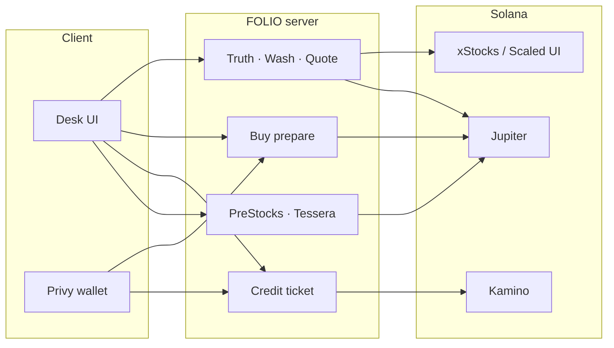
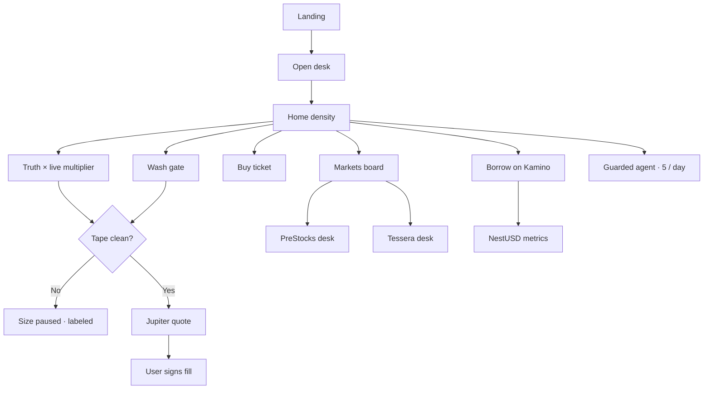
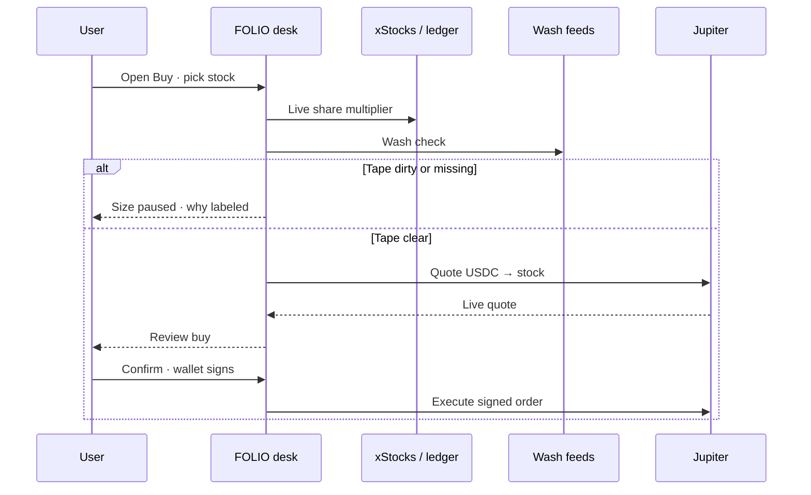
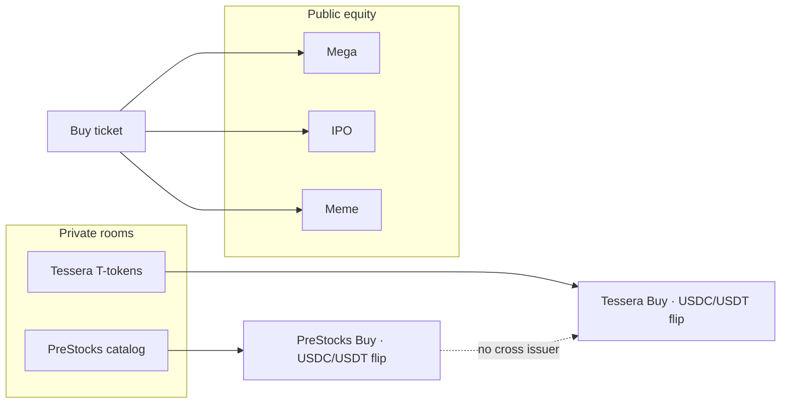

<p align="center">
  <a href="https://folio-tawny-one.vercel.app">
    
  </a>
</p>

<p align="center">
  
</p>

<p align="center">
  <a href="https://folio-tawny-one.vercel.app"></a>
  <a href="https://hackathons.solana.com/hackathons/stocklana"></a>
  <a href="https://github.com/henrysammarfo/folio"></a>
</p>

<p align="center">
  
  
  
  
  
  
</p>

---

## Project description and overview

**FOLIO** is an honest stock desk for tokenized US equities on Solana.

Token balances on chain can lie after dividends and splits. Dirty pools can look green until you size into them. Borrow tools often ask you to sell the thing you wanted to keep. FOLIO is built to fix that stretch of the journey in one place.

You open the desk. You see the live share multiplier. You see whether the tape is clean enough to size. You buy with a live Jupiter quote and your own wallet signature. You can borrow USDC on Kamino rails without selling the shares. PreStocks and Tessera each keep their own room so private names never get mixed into public equity theater.

> Soft pitch we use everywhere: FOLIO buys the US stocks you want on Solana. It keeps share counts honest, will not buy in shady pools, and lets you borrow cash without selling.

We never invent fills. We never invent mints. We never claim the desk is unhackable. Missing feeds fail closed and stay labeled.

**Live product:** https://folio-tawny-one.vercel.app  
**Pitch deck:** https://folio-tawny-one.vercel.app/pitch  
**Video scripts:** [`docs/VIDEO_SCRIPTS.md`](docs/VIDEO_SCRIPTS.md) · Pitch Video + Technical Video

---

## Stocklana · three tracks we ship

FOLIO is built so judges can score three clean tracks without one soup.

| Track | What is live | Where to click |
| :--- | :--- | :--- |
| **1. Investing and credit** | Truth ×, wash refuse, Jupiter Buy, Markets multi venue, Kamino borrow, weekend cash session refuse | `/desk` · `/desk/acquire` · `/desk/markets` · `/desk/credit` · `/network` |
| **2. PreStocks** | Live PreStocks catalog, logos, catalog list kept, TokenSelect + USDC/USDT flip, wash gated size, buys in FOLIO | `/desk/preipo` |
| **3. Tessera** | Live Tessera T tokens, separate desk, catalog kept, USDC/USDT flip, labeled loan participation, no PreStocks mix | `/desk/tessera` |

Doctrine on every track: fail closed adapters, no mocks, no silent greens, no fake fills, no cross issuer mixing.

```mermaid
flowchart TB
  subgraph T1["Track 1 · Investing and credit"]
    Truth[Truth ×]
    Wash[Wash gate]
    Buy[Jupiter Buy]
    Credit[Kamino borrow]
  end
  subgraph T2["Track 2 · PreStocks"]
    PCat[PreStocks catalog]
    PBuy[USDC/USDT flip ticket]
  end
  subgraph T3["Track 3 · Tessera"]
    TCat[Tessera catalog]
    TBuy[USDC/USDT flip ticket]
  end
  Desk[FOLIO desk] --> T1
  Desk --> T2
  Desk --> T3
  PBuy -.->|never mix| TBuy
```



### How partner tracks were integrated

1. **Public spine first.** xStocks multiplier, wash, Jupiter quote, Kamino LTV, session gate. Network matrix labels every capability.
2. **PreStocks desk.** Adapter `fetchPreStocksCatalog` · server bundle quotes stable ↔ mint · UI keeps **catalog list + Buy style ticket** · TokenSelect allowXstocks false · extraOptions from catalog only · side buy/sell · no Tessera mints on this path.
3. **Tessera desk.** Adapter `fetchTesseraCatalog` · same hybrid UX · T tokens only · docs and code keep PreStocks ≠ Tessera.
4. **Overview lanes.** Partner lane tabs on home link into the same desks. Logos and skeletons. Never bare Loading.
5. **Honesty under load.** Jupiter 429s and thin wash feed pause size with labels. We do not invent clear wash or invent marks.

---

## Flaws we found · and how we lived with them

Full ledger: [`memory/FLAWS_AND_WORKAROUNDS.md`](memory/FLAWS_AND_WORKAROUNDS.md). Technical video walks these live.

| Flaw | What broke | What we did |
| :--- | :--- | :--- |
| Jupiter Price v3 429s under parallel catalog fetch | Empty board risk | Stagger probes · TTL cache · leave cells labeled · never invent marks |
| Raydium TVL without mid | Fake price temptation | Show as liquidity awareness only |
| Meteora DBC SDK + Anchor in SSR | Whole desk HTTP 500 | Production path config + RPC reads · SDK behind flag for tests |
| Mainnet DBC pool create cost | Cannot sponsor on ≤~$1 budget | Document comfortable 0.05–0.08 SOL · never invent pool address |
| Solami Blur prepaid GB | Demo tax pressure | Solami RPC tape for live path · Blur optional labeled |
| NestUSD execute | Partner boundary | Metrics only in FOLIO · never fake Nest CPI |
| Partner catalog rewrite | Tickets without lists | Restored catalog + flip hybrid · PreStocks and Tessera separate |
| Pyth Hermes free trial | Paywall | Off ship path · free equity refs for diverge |

We document residual risk in [`memory/THREAT_MODEL.md`](memory/THREAT_MODEL.md). We will not say unhackable.

---

## Technology stack and partners

| Layer | Tools | Role on FOLIO |
| :--- | :--- | :--- |
| Desk UI | TanStack Start, React, Vite, TypeScript | Consumer desk shell, Netro style density home, Buy Markets Borrow |
| Auth and tenancy | Privy, Supabase, httpOnly sessions | Wallet and email sign in without stuffing secrets into localStorage |
| Spot markets | Jupiter Price and Swap, free tape, Raydium awareness, Solami when keyed | Live marks and quotes. Fail closed when cool |
| Share truth | xStocks API, Pyth when keyed, on chain Scaled UI compare | Live multiplier and API versus ledger check |
| Credit | Kamino xStocks LTV, NestUSD metrics | Borrow in desk when armed. Nest execute stays on Nest |
| Partners | PreStocks API, Tessera API | Separate desks. Buys stay inside FOLIO |
| Honesty | Wash gate, rate limits, TTL caches, network matrix | Shared boards for concurrent desks without invented greens |



---

## How the desk flows

Pitch order we demo out loud: Truth, then Wash, then Buy, then Borrow, then Agent.





---

## Core capabilities

### 1. Share counts you can trust

Corporate actions change what a token balance means. FOLIO reads the live share multiplier from xStocks and compares it to on chain Scaled UI when the ledger answers. Economic shares are qty times multiplier. Paper estimates stay labeled until a wallet is bound.

### 2. Wash refuse before size

If the tape looks thin, missing, or dirty, the desk pauses size. The UI says why. There is no silent green. Wash results share process cache so many concurrent users do not thrash upstream RPM.

### 3. Buy and rotate in one desk

USDC to stock or stock to stock. Searchable token pickers. Flip the legs. Live Jupiter quote. Confirm inside FOLIO. Your wallet signs when fills are armed. Broadcast stays paused until policy turns it on.

### 4. Markets without invented marks

Curated Mega IPO and Meme lanes on the board. Search expands into the full Solana xStocks universe with Jupiter batch marks. Venue and stock ref labels stay honest. Partner private names live on PreStocks and Tessera, not jammed into the public board tabs.

### 5. Borrow without selling

Keep the shares. Unlock USDC on live Kamino LTV inside the desk. Deposit and borrow are user signed. NestUSD shows live risk metrics. Nest execute is still Nest’s app.

### 6. Partner rooms kept separate

PreStocks private SPV names and Tessera T tokens each get their own catalog and ticket. Cross issuer mixing is refused on purpose so bounty lanes stay clean.



### 7. Guarded agent

Short answers about truth, wash, quotes, and credit. Five messages per account per day. The agent never pretends a fill happened.

---

## Honest limits

- Mainnet read and quote first. Custom program mainnet deploy is out of a tiny wallet budget.
- Fills and Kamino sign paths stay paused until `BROADCAST_PAUSED` is false and keys are live.
- NestUSD is metrics only in FOLIO today.
- Multi tenant wallet qty needs Privy plus Supabase session keys. Inspect and watch wallet still do mainnet reads.
- Jupiter and upstream feeds can rate limit. Stale cache is labeled. Gaps fail closed.
- We document residual risk in `memory/THREAT_MODEL.md`. We will not say unhackable.

---

## Repository map

```
folio/
├── src/
│   ├── routes/                 # Marketing pages and /desk surfaces
│   ├── components/             # Desk shell, Buy ticket, Netro density, logos
│   ├── lib/
│   │   ├── adapters/           # Jupiter, xStocks, wash, Kamino, wallets
│   │   ├── auth/               # Privy session, tenants, rate limits
│   │   └── desk.*.ts           # Server functions for each desk surface
│   └── styles.css              # FOLIO tokens plus Netro density chrome
├── docs/                       # Bible, demo scripts, submit pack, video scripts
├── memory/                     # Current state, session log, fact check, threats
├── public/                     # OG banner, FOLIO mark, Netro gear assets
└── scripts/                    # Smoke, keys, replay helpers
```

---

## Getting started

### Prerequisites

- Node.js 20 or later
- Git
- A local `.env` copied from `.env.example` (never commit secrets)

### Install and run

```bash
git clone https://github.com/henrysammarfo/folio.git
cd folio
npm install
cp .env.example .env
npm run dev
```

Open the local URL Vite prints. Production desk is already live at https://folio-tawny-one.vercel.app

### Useful scripts

```bash
npm run build && npm run preview
npm test
npm run test:e2e
npm run replay          # unit + e2e + empire smoke + build
npm run smoke:keys      # labeled key readiness
```

---

## Demo videos

Stocklana Links form wants two URLs. Scripts are human and shot listed in [`docs/VIDEO_SCRIPTS.md`](docs/VIDEO_SCRIPTS.md).

| Form field | Length | Script |
| :--- | :--- | :--- |
| **Pitch Video** | about 2 min 15 sec | Wow · impress · intrigue · ten year vision · three tracks · soft pitch |
| **Technical Video** | about 3 min 30 sec | Partner integration · PreStocks · Tessera · flaws · fail closed spine |

Pitch deck to follow while recording: https://folio-tawny-one.vercel.app/pitch

Record with Loom or YouTube. Paste both links on the Stocklana form. Keep voice soft. Never say you filled unless the wallet actually signed.

---

## Docs judges and builders use

| Doc | Purpose |
| :--- | :--- |
| [`docs/FOLIO_BIBLE.md`](docs/FOLIO_BIBLE.md) | Product doctrine |
| [`docs/DEMO_SCRIPT.md`](docs/DEMO_SCRIPT.md) | Short spoken pitch |
| [`docs/VIDEO_SCRIPTS.md`](docs/VIDEO_SCRIPTS.md) | Pitch + Technical video scripts |
| [`docs/STOCKLANA_SUBMISSION.md`](docs/STOCKLANA_SUBMISSION.md) | Form paste pack |
| [`docs/FOLIO_WHITEPAPER.md`](docs/FOLIO_WHITEPAPER.md) | Long form writeup |
| [`memory/CURRENT_STATE.md`](memory/CURRENT_STATE.md) | Live product state |
| [`memory/FLAWS_AND_WORKAROUNDS.md`](memory/FLAWS_AND_WORKAROUNDS.md) | Flaws ledger |
| [`memory/THREAT_MODEL.md`](memory/THREAT_MODEL.md) | Residual risk |
| Live pitch deck | https://folio-tawny-one.vercel.app/pitch |

---

## Submit posture

Stocklana first. Colosseum World’s Fair next. Same honesty on both. A working live spine beats fake mainnet theater. Soft pitch only in user facing copy. Accra is the build base. Beachhead ICP is EU and APAC non US.

Built in Accra. Shipped for the world.
